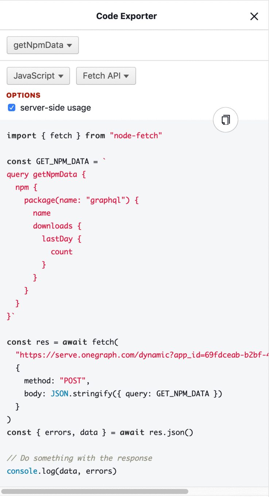

# Code Exporter for GraphiQL

A GraphiQL addon that generates ready-to-run code for your queries and mutations.  
It provides a wide range of default snippets, but is also extendable with custom snippets.

[](https://bundlephobia.com/result?p=graphiql-code-exporter)



> Read the [introduction blog post](https://www.onegraph.com/blog/2019/05/03_Filling_in_the_GraphQL_Pipeline_Ready_to_use_code_generation.html) to learn why and how we built it!

## Installation

```sh
# yarn
yarn add graphiql-code-exporter

# npm
npm i --save graphiql-code-exporter
```

## Built-in Snippets

- **JavaScript**
  - fetch
  - react-apollo

[ < your favorite language/framework/library > ](https://github.com/OneGraph/graphiql-code-exporter/pulls)

## Usage

```javascript
import React, { Component, Fragment } from 'react'
import GraphiQL from 'graphiql'
import CodeExporter from 'graphiql-code-exporter'
import 'graphiql-code-exporter/CodeExporter.css';

// Optional if you want to use a custom theme
import 'codemirror/theme/neo.css';

const serverUrl = /* your server url here */

export default class GraphiQLWithCodeExporter extends Component {
  state = {
    codeExporterIsVisible: false,
    query: ''
  }

  toggleCodeExporter = () => this.setState({
    codeExporterIsVisible: !this.state.codeExporterIsVisible
  })

  updateQuery = query => this.setState({
    query
  })

  render() {
    const { query, codeExporterIsVisible } = this.state

    const codeExporter = codeExporterIsVisible ? (
      <CodeExporter
        hideCodeExporter={this.toggleCodeExporter}
        snippets={snippets}
        serverUrl={serverUrl}
        context={{
          appId: /* APP_ID */
        }}
        headers={{
          Authorization: 'Bearer ' + /* AUTH_TOKEN */
        }}
        query={query}
        // Optional if you want to use a custom theme
        codeMirrorTheme="neo"
      />
    ) : null

    return (
      <Fragment>
        <GraphiQL
          onEditQuery={this.updateQuery}
          query={query}>
          <GraphiQL.Button
            onClick={this.toggleCodeExporter}
            label="Code Exporter"
            title="Toggle Code Exporter"
          />
        </GraphiQL>
        {codeExporter}
      </Fragment>
    )
  }
}
```

## Props

| Property         | Type        | Description                                                                                                                                                                                               |
| ---------------- | ----------- | --------------------------------------------------------------------------------------------------------------------------------------------------------------------------------------------------------- |
| hideCodeExporter | _Function_  | A callback function that is called when clicking the close (x) button in the upper right corner of the panel.                                                                                             |
| serverUrl        | _URI_       | The server url for your GraphQL endpoint.                                                                                                                                                                 |
| query            | _string_    | A string containing the GraphQL query that is synced with the GraphiQL query editor.                                                                                                                      |
| snippets         | _Snippet[]_ | A list of snippet objects that one can choose from to generate code snippets.                                                                                                                             |
| headers          | _Object?_   |  An optional object containing app specific HTTP headers                                                                                                                                                  |
| context          | _Object?_   |  An optional object containing any additional keys required to render app specific snippets                                                                                                               |
| codeMirrorTheme  | _string?_   | The name of the [CodeMirror theme](https://codemirror.net/demo/theme.html) you'd like to use e.g. `neo`. Make sure to also import the theme's css in your code (e.g. `import 'codemirror/theme/neo.css')` |

## Snippets

What we call **snippet** here, is actually an object with 4 required keys.

| Key                      | Type       | Description                                                                                                                                                       |
|--------------------------|------------|-------------------------------------------------------------------------------------------------------------------------------------------------------------------|
| name                     | _string_   | A name that is used to identify the snippet.                                                                                                                      |
| language                 | _string_   | A language string that is used to group the snippets by language.                                                                                                 |
| codeMirrorMode           | _string_   | A valid [CodeMirror mode](https://codemirror.net/mode/) used for syntax highlighting. Make sure to also require the mode (e.g. `import 'codemirror/mode/jsx/jsx'` |
| options                  | _Option[]_ | Options are rendered as checkboxes and can be used to customize snippets. They must have an unique id, a label and an initial value of either true or false.      |
| generate                 | _Function_ | A function that returns the generated code as a single string. It receives below listed data as an object.                                                        |
| generateCodesandboxFiles | _Function_ | A function that returns a set of codesandbox files, e.g. `{'index.js': {content: 'console.log("hello world")'}}`. It receives below listed data as an object.     |

#### Snippet Data

| Key        | Type          |  Description                                                                            |
| ---------- | ------------- | --------------------------------------------------------------------------------------- |
| serverUrl  | _string_      | The passed GraphQL server url                                                           |
| operations | _Operation[]_ | A list of GraphQL operations where each operation has the [operation](#operation) keys. |
| options    | *Object*      | A map of option-boolean pairs providing whether an option is selected or not            |
| headers    | _Object?_     | The `headers` object that is passed to the CodeExporter component                       |
| context    | _Object?_     | The `context` object that is passed to the CodeExporter component                       |

##### Operation

| Key          |  Type                   | Description                                                                                               |
| ------------ | ----------------------- | --------------------------------------------------------------------------------------------------------- |
| name         | _string_                | The selected GraphQL operation name                                                                       |
| type         | _"query" \| "mutation"_ | The selected operation's type                                                                             |
| query        |  *string*               |  A formatted string containing the GraphQL operation                                                      |   |
| variableName | _string_                | The operation name but in UPPER_CASE as that's the common way to declare GraphQL operations in JavaScript |
| operation    | _Object_                | The plain GraphQL parser result for this operation                                                        |
| variables    | _Object_                |  A map of all used variables for this specific operation                                                  |

#### Example

The following example implements a subset of the built-in _Fetch API_ snippet.  
The output will look similar to the demo above.

```javascript
const fetchSnippet = {
  language: 'JavaScript',
  prismLanguage: 'javascript',
  name: 'Fetch API',
  options: [
    {
      id: 'server',
      label: 'server-side usage',
      initial: false,
    },
  ],
  generate: ({serverUrl, operations, options}) => {
    // we only render the first operation here
    const {query} = operations[0];

    const serverImport = options.server
      ? 'import { fetch } from "node-fetch"'
      : '';

    return `
${serverImport}

const res = await fetch("${serverUrl}", {
  method: 'POST',
  body: JSON.stringify({ query: \`${query}\` }),
})
const { errors, data } = await res.json()

// Do something with the response
console.log(data, errors)
`;
  },
};
```

#### Extending the built-in snippets

If we want to use both custom and all the built-in snippets, we can import them from npm.

```javascript
import snippets from 'graphiql-code-exporter/lib/snippets'

const customSnippet = /* custom snippet */

const extendedSnippets = [
  ...snippets,
  customSnippet
]
```

This is also useful if you want to filter or modify single snippets.

## License

graphiql-code-exporter is licensed under the [MIT License](http://opensource.org/licenses/MIT).<br>
Documentation is licensed under [Creative Common License](http://creativecommons.org/licenses/by/4.0/).<br>
Created with ♥ by [@rofrischmann](http://rofrischmann.de) and all the great contributors.
